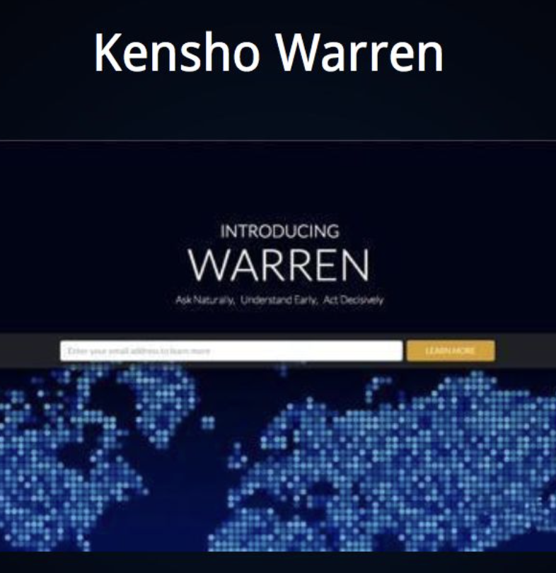

> 一本2022年关于 Explainable AI 的出版物，各种大模型涌现和各种黑盒算法层出不穷的今天有多少模型或者企业在坚持做可解释人工智能？或者这里的可解释人工智能是不是已经因为阻碍了AI的野蛮发展而“过时”了？

  
    
  
    
  
  🛒 分类：
  
  <a href="{{site.baseurl}}/categories/#{{category|slugize}}">{{category}}</a>
  &nbsp;
  

# 金融科技知识图谱 *(FinTech Glossary The Book)*  

作者：金融科技理论与应用研究小组（依托北大的一个专家组，由官方监管机构和学术专家共同组建）  
时间：2021年

## 🏗️ 本书大纲
- Digital Econ（数字经济、数字金融）
- AI
- Credit（信用科技）
- Crypto（数字货币、区块链）
- Payment（支付科技、支付技术）
- RegTech（监管科技、监管技术、网络分析）
- AML, Anti-Money Laundry（反洗钱）
- Cyber Security（网络信息安全）
- Personal Info Protection & Data Security（个人信息保护和数据安全）
- Quantitative, Quant（量化）
- Insurance（保险）

## 👀 目录：词条和解释（点击"📖👈"跳转 ）

### 1. 数字经济和数字金融 / Digital Econ [`📖👈`](#第一部份digital-econ-数字经济和数字金融)
- [`Digital Economy`](#digital-economy-数字经济)
- [`SME Finance`](#sme-finance-小微企业金融)
- [`Inclusive Finance`](#inclusive-finance-普惠金融)
- [`BE, Behavioural Economics`](#be-behavioural-economics-行为经济学)
- [`Crowdfunding`](#crowdfunding-众筹)
- [`Sharing Economics`](#sharing-economics-共享经济)
- [`VB, Virtual Bank`](#vb-virtual-bank-虚拟银行)
- [`Open Banking`](#open-banking-开放银行)
- [`(Financial) Risk Management`](#financial-risk-management-金融风险管理)

### 2. 人工智能相关支持技术 / AI [`📖👈`](#第二部份ai)
- [`AI`](#ai-人工智能)
- [`ML, Machine Learning`](#ml-machine-learning-机器学习)
- [`DM, Data Mining`](#dm-data-mining-数据挖掘)
- [`Big Data`](#big-data-大数据)
- [`Knowledge Graph`](#knowledge-graph-知识图谱)
- [`CNA, Complex Network Analysis`](#cna-complex-network-analysis-复杂网络分析)
- [`SNA, Social Network Analysis`](#sna-social-network-analysis-社交网络分析)
- [`Visualization`](#visualization-可视化)
- [`DL, Deep Learning`](#dl-deep-learning-深度学习)
- [`Federated Learning`](#federated-learning-联邦学习)
- [`Cloud Computing`](#cloud-computing-云计算)
- [`NoSQL Database`](#nosql-database-非关系型数据库)
- [`Biometrics`](#biometrics-生物识别)
- [`IoT, Internet of Things`](#iot-internet-of-things-物联网)

### 3. 信用科技 / Credit [`📖👈`](#第三部份credit-tech-信用科技)
- [`Credit`](#credit-信用)
- Creditworthiness
- [`Credit Risk`](#credit-risk-信用风险)
- Credit Risk Management
- [`Consumer Finance`](#consumer-finance-消费金融)
- [`Fintech Credit`](#fintech-credit-金融科技信贷)
- Big Tech
- Credit Reporting
- [`Credit Reporting System`](#credit-reporting-system-征信体系)
- [`Credit Bureau`](#credit-bureau-信用机构征信机构)
- Consumer Credit Bureau
- [`Consumer Credit Report`](#consumer-credit-report-消费者征信报告)
- Consumer Credit Scoring
- [`Commercial Credit Reporting`](#commercial-business-credit-reporting-企业征信)
- [`D-U-N-S number`](#d-u-n-s-number-邓白氏编码)
- Supply Chain
- [`SCF, Supply Chain Finance`](#scf-supply-chain-finance-供应链金融)
- SCM, Supply Chian Management
- Credit Rating
- [`CRA, Credit Rating Agency`](#cra-credit-rating-agency-信用评级机构)
- [`Credit Derivative`](#credit-derivative-信用金融衍生品)

### 4. 数字货币与区块链 / Crypto [`📖👈`](#第四部份crypto-数字货币与区块链)
- Bitcoin
- [`Blockchain`](#blockchain-区块链)
- Mining
- Cryptocurrency
- [`Distributed Ledger (分布式账本)`](#distributed-ledger-分布式账本)
- [`Ethereum (以太坊)`](#ethereum-以太坊)
- [`DeFi, Decentralized Finance`](#defi-decentralized-finance-去中心化金融)
- [`ICO, Initial Coin Offering`](#ico-initial-coin-offering-首次代币发行)
- [`Asymmetric Cryptography (非对称加密)`](#asymmetric-cryptography-非对称加密)

### 5. 支付科技 / Payment [`📖👈`](#第五部份payment-tech-支付科技)

- Payment
- Bill
- Bank Card
- [`Third-Party Payment`](#third-party-payment-第三方支付)
- Electronic Payment
- Internet Payment
- [`Mobile Payment`](#mobile-payment-移动支付)
- [`Cross-border Payment`](#cross-border-payment-跨境支付)
- [`Bank Card Clearing Agency`](#bank-card-clearing-agency-银行卡清算-机构)
- [`Payment Network`](#payment-network-支付网络)
- [`Payment & Clearing Association`](#payment--clearing-association-支付清算-行业协会)
- [`CBDC, Central Bank Digital Currency`](#cbdc-central-bank-digital-currency-央行数字货币)
- [`PSD2, 《The 2nd Payment Services Directive》`](#psd2-the-2nd-payment-services-directive-支付服务指令第二版)
- [`FDA, Financial Data Aggregation`](#fda-financial-data-aggregation-金融数据集合)
- [`Biometric Payment`](#biometric-payment-生物支付)

### 6. 监管科技与网络分析 / RegTech [`📖👈`](#第六部份regtech-regulation-tech-监管科技与网络分析)

- [`RegTech, Regulatory Technology`](#regtech-regulatory-technology-监科)
- [`Regulatory Sandbox`](#regulatory-sandbox-监管沙盒)
- Stress Testing
- [`Systematic Risk`](#systematic-risk-系统性风险)
- [`Financial Network`](#financial-network-金融网络)
- [`Financial Link`](#financial-link-金融链接)
- [`Guarantee Chain of Firms`](#guarantee-chain-of-firms-企业担保圈担保链)
- [`FNA, Financial Network Analysis`](#fna-financial-network-analysis-金融网络分析)

### 7. 反洗钱 / AML, anti-money laundry [`📖👈`](#第七部份aml-anti-money-laundry-反洗钱)

- AML, Anti-Money Laundering
- [`FATF, Financial Action Task Force (on Money Laundering)`](#fatf-financial-action-task-force-on-money-laundering-反洗钱金融行动特别工作组)
- [`FIU, Financial Intelligence Unit`](#fiu-financial-intelligence-unit-金融情报单元中心)
- KYC, Know Your Customer
- [`STR, Suspicious Transaction Report`](#str-suspicious-transaction-report-可疑交易报告)
- BO, Beneficial Owner
- Financial Intelligence Network
- [`Intelligence Visualization`](#intelligence-visualization-金融情报可视化)

### 8. 网络信息安全 / Cyber Security [`📖👈`](#第八部份cyber-security-网络信息安全)

- [`Information Security`](#information-security-信息安全)
- Cyber Security
- Cyber Attack
- [`Data Leakage`](#data-leakage-数据泄漏)
- [`Social Engineering`](#social-engineering-社会工程学)
- [`Ransomware`](#ransomware-勒索软件病毒)
- Dark Web
- [`BCM, Business Continuity Management`](#bcm-business-continuity-management-业务连续性管理)
- Identity Verification
- [`Fraud Detection`](#fraud-detection-诈骗检测)
- Blacklist
- Sandbox
- [`Threat Intelligence`](#threat-intelligence-威胁情报)
- [`SA, Situation Awareness`](#sa-situation-awareness-态势觉知)

### 9. 个人信息保护与应用 / Personal Info & Data Protection [`📖👈`](#第九部份personal-info--data-protection-个人隐私保护)

- Personal Information
- Personal Financial Information
- Personal Credit Information
- [`Alternative Data`](#alternative-data-替代数据)
- [`Data Broker`](#data-broker-数据中间商代理人)
- Personal Information Protection
- [`Personal Privacy Protection`](#personal-privacy-protection-个人隐私保护)
- [`GDPR, 《General Data Protection Regulation》`](#gdpr-general-data-protection-regulation-通用数据保护条例)
- [`DPO, Data Protection Officer`](#dpo-data-protection-officer-数据保护官)
- [`Cross-Border Data Flow`](#cross-border-data-flow-跨境数据流转)
- [`Personal Data Profiling`](#personal-data-profiling-个人数据画像)
- Identity Theft
- [`Differential Privacy`](#differential-privacy-差分隐私)

### 10. 量化投资 / Quantitative, Quant [`📖👈`](#第十部份quant-量化投资)

- [`Algorithm Trading`](#algorithm-trading-算法交易)
- [`QA, Quantitative Analysis`](#qa-quantitative-analysis-量化分析)
- [`Quant, Quantitative Investment`](#quant-quantitative-investment-量化投资)
- Robo-Advisor

### 11. 保险科技 / Insurance [`📖👈`](#第十一部份insurance-tech-保险科技)

- [`Insurance Technology`](#insurance-technology-保险科技)
- [`Cyber-Insurance`](#cyber-insurance-赛博保险)
- [`P2P Insurance`](#p2p-insurance-p2p保险)
- [`IoT Insurance`](#iot-insurance-物联网保险)
- [`UBI, Usage-Based Insurance`](#ubi-usage-based-insurance-基于使用量的保险)
- [`Internet Insurance`](#internet-insurance-互联网保险)

# 主体

## 第一部份：Digital Econ 数字经济和数字金融

### Digital Economy 数字经济

1. 名词  

- 数字经济：  
以data资源为核心，以IT（信息技术）为驱动，透过数字化工具（网络/平台/系统）产生的所有 **生产、分配、交换、消费等全部经济活动** 的总和。  
别称：New Econ、Web Econ、etc.

- 互联网金融：  
用互联网平台和技术从事的金融本质的业务。
- FinTech：  
突出的是技术。
- 数字金融：  
广义，金融业务的数字化形态。

- 数字鸿沟 Digital Divide：技术的拥有程度、应用程度、创新能力，是人与人/厂与厂之间的鸿沟差距所在。

- MNO = Mobile Network Provider

- PSP = Payment Service Provider

2. 重点

> 数字经济不是独立的“虚拟”经济，是传统经济基础上产生的。……是【高级的】经济发展形态。  

> 1997年就有 digital economy 的概念，且已经预知了数字时代价值创造的两个主要驱动力————数据化和平台化

> 数字经济是数字金融的基础环境，数字金融可以为小微企业提供：融资渠道、电子支付系统、安全的金融产品、数字化财会账本（历史记录）。

### SME Finance 小微企业金融

1. 名词

- SMEs：Small and Medium Enterprises 中小企业
- MSMEs：Micro, Small and Medium Enterprises 中小微企业
- MSEs：Micro and Small Enterprises 小微企业
- 以上3个疑似无定式，默认“小微”=含有个体个人在内，“中小”=“正经”的小公司。

- PPP，Paycheck Protection Program，美国2020年新冠疫情期间颁布的一个政策，保护小微企业的。

- EFL，Entrepreneurial Finance Lab，一家秘鲁的创业金融实验室。通过心理测试搞个人/小微企业主的信贷风险预测的。

2. 重点
> 小微企业在全球大多数经济体中，都是就业机会和经济发展的主要贡献者（发展中国家更明显）。 数据：小微占社会 90%的企业，50%的就业机会。

> 统计数据：2018年（疫情前）发展中国家中【小微企业】里约40%的融资需求得不到满足；其中中国的小微企业更是来到了80%。（思考：疫情后呢？）

> 透过EFL的（基于心理测试的）风险评估模型的案例分析得到：1. 重点是“消费者”和“小微企业主”的信贷记录有很多相似之处；2. 有银行靠这个模型给（无法验证收入的）个人消费者/小微企业主提供贷款服务且挣到钱了。

3. 关键词  
个人征信、企业征信、信用评估、征信体系、替代数据

### Inclusive Finance 普惠金融

1. 名词

- Inclusive Finance：  
2005年联合国提出的词汇，强调用政策的手段，帮助贫困人群、小微企业主等小百姓能获得价格合理、方便快捷的金融服务。  
*（思考：除了降低高利贷黑社会的风险，普通人真的需要金融服务吗？还是说借扫黑除恶的旗号，行驶消费主义洗脑的事？）*

2. 重点

> 所谓的普惠金融，必须是满足以下3点的：
一是涵盖整个金融体系和所有人群；二是内涵丰富（包括金融消费者保护、代理银行、手机银行等等多方面）；三是多方参与（国际到国内、政府到非政府都要参与推进）。总的来说，这是一个必须严加监管和调控的课题，否则会非常容易产生剥削和贫富差距的加剧。  

3. 思考：***普惠金融究竟“惠民”还是“利商”？以及角落里的“消费主义倾向”***  

ps：具象问题抽象化 = 普惠金融的初衷与现实挑战。  

- 普惠金融的初衷
    - 反驳最初疑问：  
        - 普惠金融的意义超越了降低高利贷和黑社会风险。  
    - 普惠的初衷：  
        - **促进经济参与**：助于MSEs/个人参与经济活动，创造收入和就业机会。
        - **提高生活质量**：不仅是贷款，储蓄、保险和支付等服务也都算金融服务哦。
        - **减少贫困和不平等**：有论调称“金融排斥往往加剧社会不平等。”（？怎么做）

- 普惠金融实践中的挑战
    - **打“惠民”旗号行驶“利商”之事**：  
    如果金融服务过度商业化，可能偏离惠及大众的初衷，反而加剧不平等。
    - **角落里的“消费主义”倾向**：  
    鼓励超前消费和过度授信的消费贷可能诱导个人负债累累，而非真正改善生活质量。

- 辩证：站在接受普惠金融的小微企业主或个体消费者角度

    - 内力：
        - **生存需求迫使他们接受金融服务**：  
        最直观的例子，就是网约车平台向司机“提供”出租车后再每月抽取司机的收入来按揭还车贷，司机不用平台规定的新车就接不到单，用新车又变相帮平台转嫁了车贷风险。此时可视为平台和车企联合**迫使**MSEs/个体成为这个畸形**金融产品**的**消费者**。其他类似的套路可以是“贷款买课”、“贷款加盟”等。  
        - **信息不对称（数字鸿沟 Digital Divide）的受害者**：  
        缺乏金融知识、利率高低的参考信息、债务危机应对知识、甚至是挣钱还贷技能的缺失。
        - **对未来的希望和奋斗**：  
        债务人相信通过努力工作或积极创业，能够改善自己的处境。他们的选择是基于对更好生活的追求，而非贪婪或不负责任。

    - 外力：
        - **制度和环境的受害者**：  
        “强者不抱怨环境是因为就是他们搞坏了环境”，所以。
        - **被资本驱动的工具化**：  
        在金融机构和平台的剥削下，他们被高利率、苛刻的合同条款和不公平的收益分配所压榨。被视为利润的来源，而非需要支持和保护的个人。
        - **缺乏社会支持**：  
        社会安全网和再就业支持的缺失，使他们没有其他出路。

    - 哪怕失信也无错，对吗？  
        - 他们的选择是在困境中的无奈之举，不应被责备。真正的问题在于社会制度和金融体系未能提供公平的机会和安全网。他们需要的是支持、教育和真实的机会，而非被推向更深的债务泥潭。

- 辩证：站在发行和推广普惠金融的BigTech大厂或规则制定者角度
    - 推动经济发展和创新：通过普惠金融，更多人能够获得资金，创业创新，促进经济活力和就业增长。这也是国家刺激经济政策的一个目的。
    - 技术赋能和效率提升：大型科技公司利用大数据、人工智能等技术，提高金融服务的效率和覆盖面，降低交易成本。
    - 满足市场需求：他们提供的金融产品和服务是 ***对市场需求的回应*** ，帮助那些传统金融机构覆盖不到的人群，最直观的例子：**“过度授信”反而帮助债务人轻易地“拆东墙补西墙”**。
    - 遵守法律法规：他们在现有的法律框架内运营，所有的业务活动都是合法合规的。

    - 哪怕加剧了贫富差距，构成了剥削，也没有错吗？  
    尽管他们声称在推动普惠金融，但实际操作中可能存在借“普惠”之名，行“敛财”之实的情况。他们是否真的关注了服务对象的利益？是否考虑了长期的社会影响？过度商业化和资本驱动可能背离了普惠金融的初衷，加剧了社会不平等。
        - 责任的转嫁：  
        本质是将金融风险和负担转嫁给（抗风险能力更弱的）个人和MSEs，而缺乏必要的保护措施。
        - 利润至上，忽视社会责任：  
        追求极致的商业利益，摈弃对弱势群体的保护。
        - 垄断和不公平竞争：  
        利用市场优势地位，设置不合理的准入门槛和收费标准，限制竞争（DD网约车必须跟他们贷款买新车才能注册成为司机，普通私家车要么嫌旧要么不优先派单）。
        - 监管不足与道德风险：  
        监管机制的滞后和不完善，导致一些企业钻法律空子，进行不道德的商业行为。 

4. 关键词
移动支付、消费金融、消费者征信、替代数据、个人信息保护、数据代理商、社交网络

### BE, Behavioural Economics 行为经济学

1. 名词
- 行为经济学： 经济学+行为分析+心理学，目的是修正【古典经济学】中的理性人、效用最大化等假设的“不足”，解释消费者决策中的非理性现象。

- **行为经济学的三大基石**（得过诺贝尔奖的）：
    - Prospect Theory 前景理论
    - Anchoring Effect 锚定效应
    - Mental Accounting 心理账户/精神会计

- Prospect Theory 前景理论  
人们在面对风险和不确定性时，如何基于潜在收益和损失的 **感知价值** 来做出决策。
    - 确定效应（Certainty Effect）：  
    人们在决策时，对确定性的结果赋予过高的权重，偏好确定的收益或损失，而非概率性的结果。宁愿选择保证获得100元，而不是有50%概率获得200元，即使两者的期望收益相同。
    - 反射效应（Reflection Effect）：  
    在人们对待收益和损失的态度中，风险偏好会出现反转：面对收益时倾向于规避风险，面对损失时则倾向于寻求风险。在可能获得收益时，倾向于选择确定的小收益；而在可能发生损失时，愿意冒险以避免确定的小损失，即使可能导致更大的损失（梭哈）。股市中的“获利了结”倾向 = 出售盈利的，持有亏损的。
    - 损失厌恶（Loss Aversion）：  
    人们对损失的感受要强于对同等收益的感受。失去100元的痛苦程度，要大于获得100元的快乐程度。
    - 参照依赖（Reference Dependence）：  
    人们评估结果时，不是基于绝对价值，而是相对于某个参照点（如现状或预期）来判断收益和损失。实际拿6k奖金，但预期得5k的人会开心，预期拿8k的人会生气；另外，自己工资10k同事工资5k，和自己工资12k同事工资20k，多数人选前者。

- Anchoring Effect 锚定效应  
指在做决策时，人们会过分依赖最初获得的信息（锚点），即使该信息可能与决策无关，进而影响后续判断和选择。先涨价再打折骚操作。

- Mental Accounting 心理账户  
人们会根据主观标准将金钱划分到不同的账户中，对待和使用金钱的方式会因其来源、用途或其他分类而异，影响财务决策。股票收益马上花，工资收入精打细算；红包收益马上花，商品直接降价反而还想再等。

2. 关键词
系统性风险、心理测量

### Crowdfunding 众筹

1. 名词

- 众筹：  
词汇引伸于“众包（Crowdsourcing）”，即分布式协作完成一个大问题，众筹则是在任务完成基础上加上伸手要钱的动作。
    - 众筹可以分四类：捐赠筹、商品筹、债券筹、股权筹
    - **债券众筹：就是P2P网贷**
    - 捐赠众筹：搞慈善

- ICO（虚拟货币发行）和众筹的关系：  
在**数字货币**和**区块链**领域，ICO是一种新技术形态包装下的众筹行为。

2. 关键词
ICO、P2P网贷

### Sharing Economics 共享经济

1. 名词 
- 共享经济：  
一种经济模式，通过（在线或线下）社区或平台来获取和提供商品或服务的访问的活动。优点是：允许人从未被充分利用的或闲置的资产中赚钱。

2. 重点  
> 记忆几个例子：  
> 联合办公空间（B2B）——wework  
> P2P借贷平台——个人以比传统信贷实体更低的利率向他人放贷  
> 时尚平台——出售或租借衣服  
> 自由职业平台——发布和找寻“兼职”（专业赛道细分，可以是共享出行的DD/Uber，共享房间的Airbnb）  

### VB, Virtual Bank 虚拟银行

1. 名词

- VB，Virtual Bank：  
另一个大名 = 【网银】，网络银行。就是非实体形式提供零售银行服务的，都能归类为VB。包括且不限于以下几个形式
    - ATM机
    - Pos机
    - 电话银行
    - 手机银行
    - 网上银行
    - ...

2. 重点

> 虚拟银行所有业务都在网上完成（账户申请、存款、借贷、投资咨询）

> 世界第一家VB，1995年在美国开张；香港金融管理局在2018年正式出台文件正式规定【虚拟银行发牌原则】

> 截至19年（疫情前），有8家在HK金融管理局发放牌照的VB，值得注意：

| 名称 | 股东 | 备注 |
|---|---|---|
| Livi VB Limited | 中国银行、京东数科、等 | 变相持股京东集团30%+股份的科技公司，做AI，区块链，数字化解决方案等 |
| SC Digital Solutions Limited | 渣打、携程、等 | 携程金融 |
| 众安虚拟金融有限公司 | 众安国际 | 香港本土专做网络保险的 |
| Web Digital Limited | WeLab | 香港本土做Fintech的，专注下南洋和港市场 |
| 蚂蚁商家服务香港有限公司 Ant SME Services HK Limited | 蚂蚁金服 | 阿里 |
| 贻丰有限公（更名为‘富融银行’） | 腾讯、中国工商银行、港交所、高领资本等 | 腾讯系 |
| 洞见金融科技有限公司 | 小米、等 | 小米系 |
| 平安壹账通银行 | 中国平安 | 平安保险 |

*截止至疫情前的数据*

### Open Banking 开放银行

1. 名词
- open bank：  
指商业银行通过API接口，向第三方技术服务商提供开放数据、算法、交易、流程、或其他金融产品的银行商业模式。

- GDPR：  
欧盟的一个赋予居民对个人数据控制权的法规，是open bank等互联网金融业务的**监管依据**。（监管依据出台了才有正式的应用和商业化基础）

- 监管机制的建立（中国）：  
我国金融业务采取牌照制度，open bank处于相对起步阶段。  
2020年（疫情后）才陆续在完善各个监管机制：生物安全法（2020出台，24年完善）、个人信息保护法（22年出台）、数据安全法（2021）、网络数据安全管理条例（2024）

### (Financial) Risk Management (金融)风险管理

1. 名词  
- Financial Risk Management：  
企业通过使用金融工具来管理风险敞口的业务操作（包括确定风险来源、风险度量、计划解决问题方案）。
    - 风险：不利情况发生的可能性 * 不利情况带来的成本
    - 定性和定量的不同度量
    - 如何使用金融工具来**对冲高风险**

- 所有金融机构都面临的**风险**：
    - 信用风险
    - 市场风险
    - 操作风险

- Risk Management 的一套完整流程：
    - Identification 风险识别：识别出的、没是识别出的风险。
    - Measurement 风险测量：高、中、低风险
    - Treatment Strategy 处置策略：规避、降低、接受、转移
    - Implementation 实施：项目管理

2. 关键词  
信用风险、征信体系、系统性风险

## 第二部份：AI

> 金融是信息技术（IT）最佳的应用场景之一；
> 新技术在金融领域的应用最容易产生效果；
> 金融业也最容易为新技术的红利买单。

### AI 人工智能

1. 名词
- AI：  
人工智能是指一系列可以做感知、学习、推理、决策的计算机技术（即，机器像人一样解决问题）。它默认“AI”作为一个系统，能接收并解释外部信息，从外部信息中学习，获取解决任务的能力，最终实现特定的目标。  

- FinTech领域所需要知道的3大AI技术  
    - **NLP natural language processing 自然语言处理（语言模型）**：  
    FinTech中，NLP可用于构建**知识图谱**、舆情分析、AI智能客服。
    - **CV computer vision 计算机视觉（图像模型）**：  
    也称为MV machine vision。在FinTech中，一般是借助图像识别技术进行**身份认证、欺诈检测**。
    - **Robotic 机器人（自动化科学x计算机科学）**：  
    FinTech中机器人可用于**机器人流程自动化**相关应用场景。自动化学科为基础设计的软件也应用于**自动量化投资**的场景。

2. 重点
> 某个实例：  
> AI市场研究助手：公司=Kensho，投资人=高盛，时间=2014。  

> 当年就已经做出了聊天式AI（Chat AI），其核心产品是金融决策引擎“Warren”，曾成功预言英国脱欧后的英镑走势，及2017年美国科技股的强势上涨。  

  

or（测试）  

  

or（测试）

3. 关键词
量化投资Quant、智能投顾、反洗钱、生物识别、身份验证、大数据、云计算

### ML, Machine Learning 机器学习

### DM, Data Mining 数据挖掘

### Big Data 大数据

### Knowledge Graph 知识图谱

### CNA, Complex Network Analysis 复杂网络分析

### SNA, Social Network Analysis 社交网络分析

### Visualization 可视化

### DL, Deep Learning 深度学习

### Federated Learning 联邦学习

### Cloud Computing 云计算

### NoSQL Database 非关系型数据库

### Biometrics 生物识别

### IoT, Internet of Things 物联网

## 第三部份：Credit Tech 信用科技

### Credit 信用

### Creditworthiness 信用度

### Credit Risk 信用风险

### Credit Risk Management 信用风险管理

### Consumer Finance 消费金融

### Fintech Credit 金融科技信贷

### Big Tech 大科技企业

### Credit Reporting 征信

### Credit Reporting System 征信体系

### Credit Bureau 信用机构/征信机构

### Consumer Credit Bureau 消费者征信局/机构

### Consumer Credit Report 消费者征信报告

### Consumer Credit Scoring 消费者信用评分

### Commercial (Business) Credit Reporting 企业征信

### D-U-N-S number 邓白氏编码

### Supply Chain 供应链

### SCF, Supply Chain Finance 供应链金融

### SCM, Supply Chian Management 供应链管理

### Credit Rating 信用评级

### CRA, Credit Rating Agency 信用评级机构

### Credit Derivative 信用（金融）衍生品

## 第四部份：Crypto 数字货币与区块链

### Bitcoin 比特币

### Blockchain 区块链

### Mining 挖矿

### Cryptocurrency 加密货币

### Distributed Ledger 分布式账本

### Ethereum 以太坊

### DeFi, Decentralized Finance 去中心化金融

### ICO, Initial Coin Offering 首次代币发行

### Asymmetric Cryptography 非对称加密

## 第五部份：Payment Tech 支付科技

### Payment 支付

### Bill 账单/票据

### Bank Card 银行卡

### Third-Party Payment 第三方支付

### Electronic Payment 电付

### Internet Payment 网络支付

### Mobile Payment 移动支付

### Cross-border Payment 跨境支付

### Bank Card Clearing Agency 银行卡清算 机构

### Payment Network 支付网络

### Payment & Clearing Association 支付&清算 行业协会

### CBDC, Central Bank Digital Currency 央行数字货币

### PSD2, 《The 2nd Payment Services Directive》 《支付服务指令》第二版

### FDA, Financial Data Aggregation 金融数据集合

### Biometric Payment 生物支付

## 第六部份：RegTech, Regulation Tech 监管科技(与网络分析)

### RegTech, Regulatory Technology 监科

### Regulatory Sandbox 监管沙盒

### Stress Testing 压力测试

### Systematic Risk 系统性风险

### Financial Network 金融网络

### Financial Link 金融链接

### Guarantee Chain of Firms 企业担保圈/担保链

### FNA, Financial Network Analysis 金融网络分析

## 第七部份：AML, anti-money laundry 反洗钱

### AML, Anti-Money Laundering 反洗钱

### FATF, Financial Action Task Force (on Money Laundering) (反洗钱)金融行动特别工作组

### FIU, Financial Intelligence Unit 金融情报单元/中心

### KYC, Know Your Customer 懂你客人

### STR, Suspicious Transaction Report 可疑交易报告

### BO, Beneficial Owner 收益所有人

### Financial Intelligence Network 金融情报网

### Intelligence Visualization 金融情报可视化

## 第八部份：Cyber Security 网络信息安全

### Information Security 信息安全

### Cyber Security 网络安全

### Cyber Attack 网络攻击

### Data Leakage 数据泄漏

### Social Engineering 社会工程学

### Ransomware 勒索软件/病毒

### Dark Web 暗网

### BCM, Business Continuity Management 业务连续性管理

### Identity Verification 身份验证

### Fraud Detection 诈骗检测

### Blacklist 黑名单

### Sandbox 沙盒

### Threat Intelligence 威胁情报

### SA, Situation Awareness 态势觉知

## 第九部份：Personal Info & Data Protection 个人隐私保护

### Personal Information 个人信息

### Personal Financial Information 个人金融信息

### Personal Credit Information 个人信用信息

### Alternative Data 替代数据

### Data Broker 数据中间商/代理人

### Personal Information Protection 个人信息保护

### Personal Privacy Protection 个人隐私保护

### GDPR, 《General Data Protection Regulation》 《通用数据保护条例》

### DPO, Data Protection Officer 数据保护官

### Cross-Border Data Flow 跨境数据流转

### Personal Data Profiling 个人数据画像

### Identity Theft 身份盗窃

### Differential Privacy 差分隐私

## 第十部份：Quant 量化(投资)

### Algorithm Trading 算法交易

### QA, Quantitative Analysis 量化分析

### Quant, Quantitative Investment 量化投资

### Robo-Advisor 智能投顾

## 第十一部份：Insurance Tech 保险科技

### Insurance Technology 保险科技

### Cyber-Insurance 赛博保险

### P2P Insurance P2P保险

### IoT Insurance 物联网保险

### UBI, Usage-Based Insurance 基于使用量的保险

### Internet Insurance 互联网保险

# 结语
